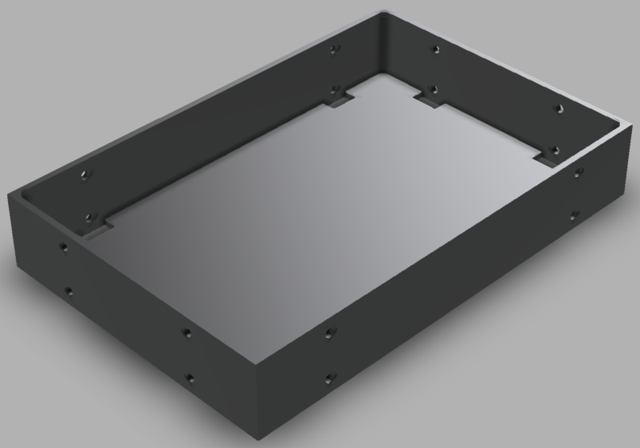
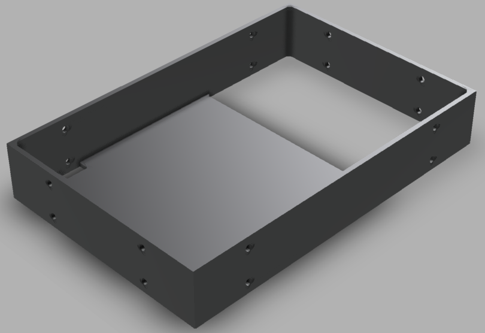
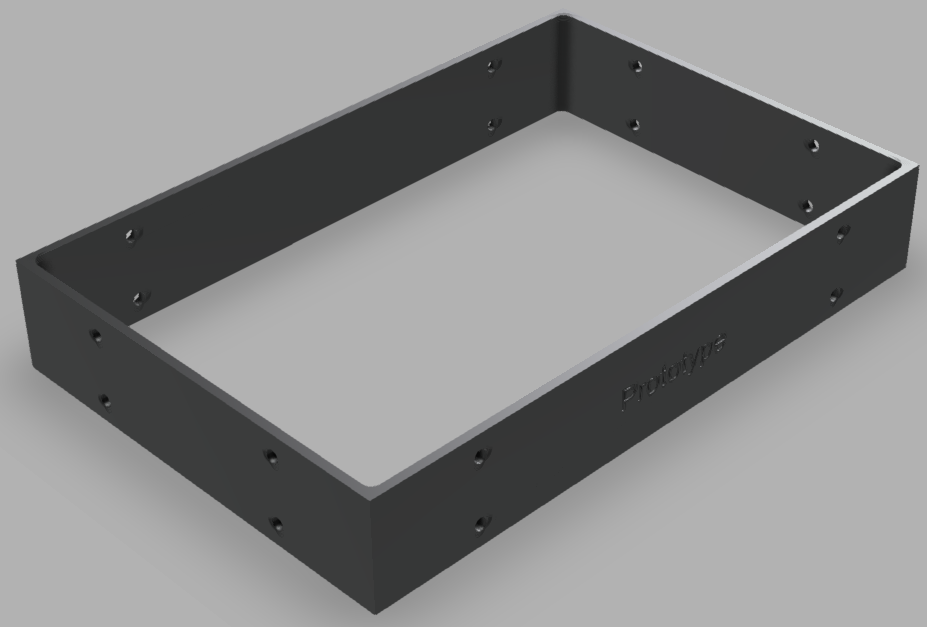

# Arm Unit
> Warning: This project is currently in prototype

Standard case specs for low powered devices. The components can be chained and inserted into
a standard server rack.

| Components                     | Link                     |
|--------------------------------|--------------------------|
| Arm Unit Case Base [Template]  | https://a360.co/37TzJ2S  |
| Arm Unit Bottom Base | https://a360.co/3jJJiV4  |
| Arm Unit Mid Case              | https://a360.co/37WQ4DW  |
| Arm Unit Vertical Extension  | https://a360.co/3rvGgaZ  |
| Joints   | https://a360.co/3KNx6hH  |

## Arm Unit Bottom Base

## Arm Unit Mid Case

## Arm Unit Vertical Extension

## Joints
