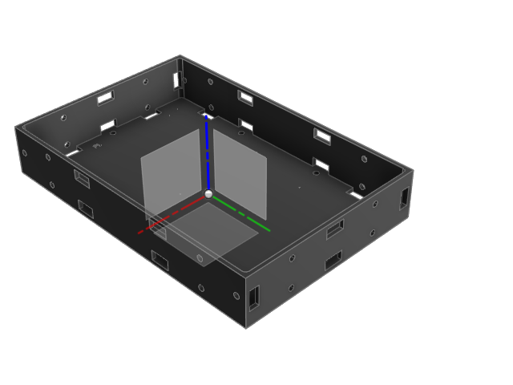
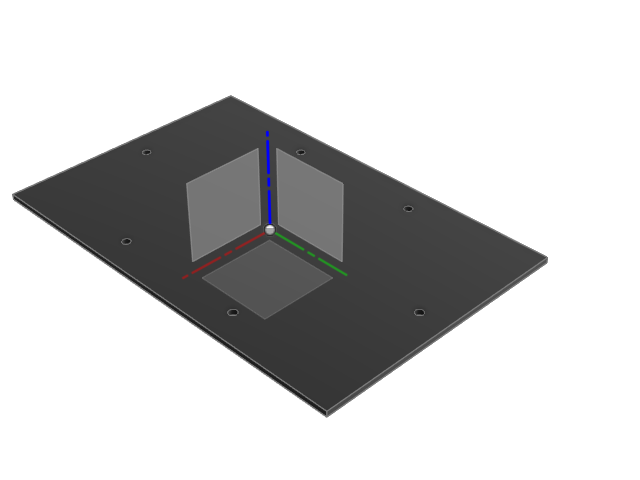
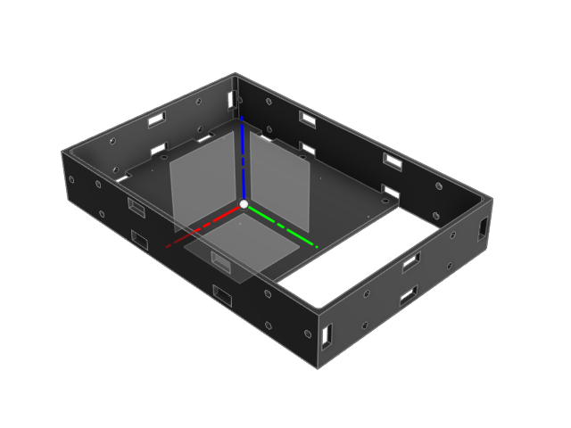
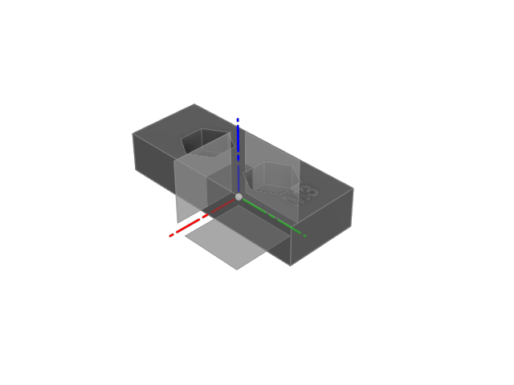
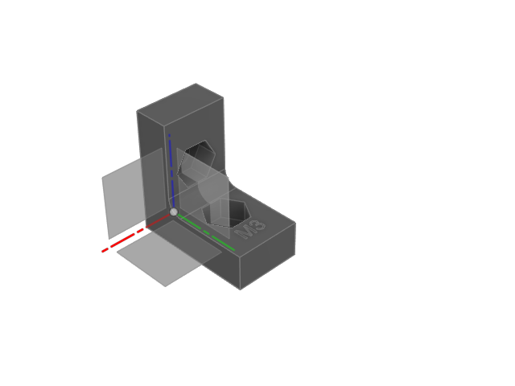

# Arm Unit

Universal modular case specification and design repository for low powered devices. The components can be chained and inserted into a standard server rack.

| Components                 | Link                     |
|----------------------------|--------------------------|
| [Arm Unit.f3d](fusion360/Arm%20Unit.f3d)        | [Autodesk Fusion 360 - Web](https://a360.co/37TzJ2S)  |
| Bolt screws & nuts - M3    | [Amazon.in - Bolt screws & nuts - M3](https://amzn.eu/d/aNlrJWk)  |
| Magnets - 5 X 2 mm (disk)    | [Amazon.in - Magnets - 5 X 2 mm](https://amzn.eu/d/6y1oyuh) |

> Find it on thingiverse: https://www.thingiverse.com/thing:5357929

> STL files in `3d` directory

## Arm Unit Bases

|                  |                                           |
|----------------------------|-----------------------------------------------|
|             |       |
|             |  |
|             |                                               |

## Arm Unit Lids

|                  |                                      |
|----------------------------|--------------------------------------|
|             |  |
|             |  |

## Arm Unit Mids

|                  |                                      |
|----------------------------|--------------------------------------|
|           |  |
|           |                                      |

## Arm Unit Joints

|                  |                                      |
|----------------------------|--------------------------------------|
|          |                                      |

## Arm Unit Base Drawing

